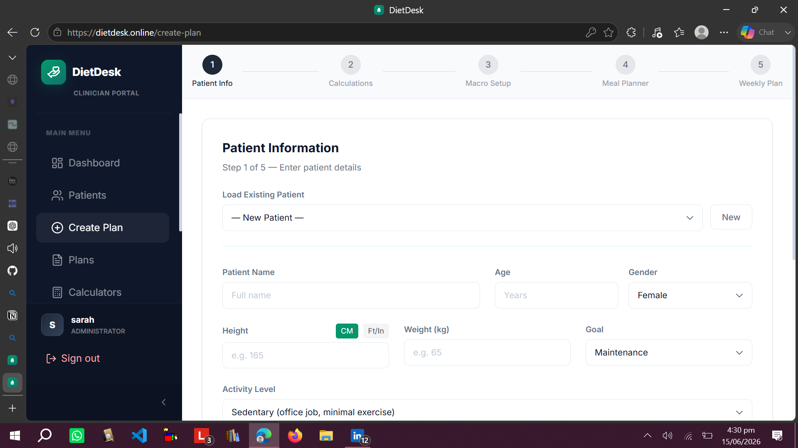
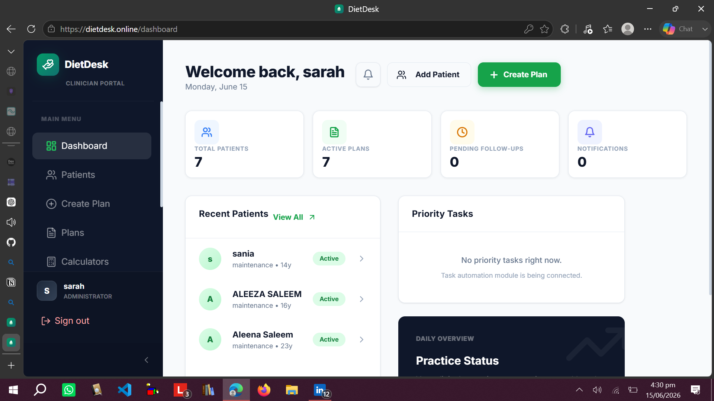
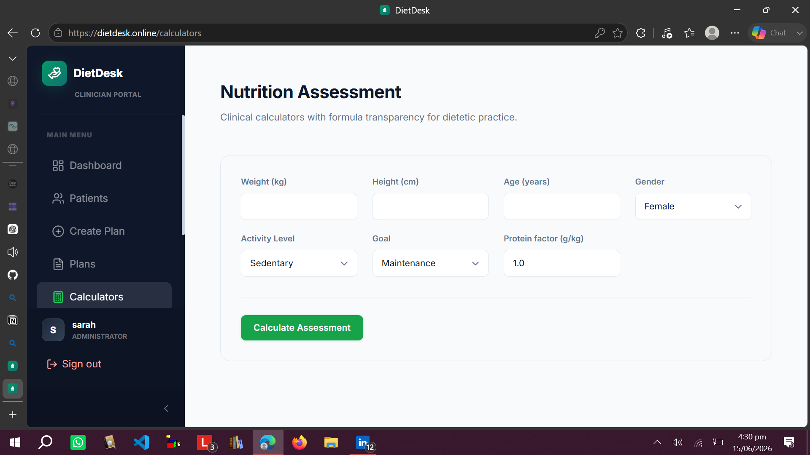

# Health Application

A full-stack health and nutrition management application with a React frontend and FastAPI backend.
Designed to provide a structured system for health-related workflows and data management.

---

## 🔗 Live / Deployment

* Frontend: Deployed on Vercel (React + Vite)
* Backend: Deployed on Hugging Face Spaces (Docker)

---

## 📁 Project Structure

```
├── Frontend/          # React + Vite frontend
│   ├── src/
│   │   ├── components/
│   │   ├── context/
│   │   ├── services/
│   │   └── utils/
│   ├── package.json
│   ├── vite.config.js
│   └── index.html
│
├── Backend/           # FastAPI backend
│   ├── app.py         # Main entry point
│   ├── Dockerfile
│   ├── requirements.txt
│   └── routers/
│
└── .gitignore
```

---
## 📸 Screenshots

### 🏠 Home Page


### 📊 Dashboard


### ⚙️ Feature View

## ⚙️ Tech Stack

### Frontend

* React
* Vite
* JavaScript

### Backend

* FastAPI
* Python
* REST APIs

### Deployment

* Vercel (Frontend)
* Docker + Hugging Face Spaces (Backend)

---

## 🚀 Features

* Full-stack architecture (frontend + backend separation)
* REST API integration between client and server
* Modular frontend structure (components, context, services)
* Scalable backend with FastAPI routing system
* Containerized backend deployment
* Production-ready frontend deployment on Vercel

---

## 🧪 Getting Started

### Frontend Setup

```bash
cd Frontend
npm install
npm run dev
```

### Backend Setup

```bash
cd Backend
pip install -r requirements.txt
uvicorn app:app --reload
```

---

## 📌 Deployment Notes

* Frontend root directory must be set to `/Frontend` on Vercel
* Backend runs using Docker on Hugging Face Spaces
* Ensure environment variables are configured before deployment

---

## 📈 Purpose

This project demonstrates full-stack development skills, including API design, frontend architecture, and cloud deployment workflows.

---

## 📜 License

For educational and portfolio use.

A full-stack health/nutrition application with a React frontend and FastAPI backend.

## Project Structure

```
├── Frontend/          # React + Vite frontend
│   ├── src/
│   │   ├── components/
│   │   ├── context/
│   │   ├── services/
│   │   └── utils/
│   ├── package.json
│   ├── vite.config.js
│   └── index.html
│
├── Backend/           # FastAPI backend
│   ├── app.py         # Main entry point
│   ├── Dockerfile
│   ├── requirements.txt
│   └── ...routers & modules
│
└── .gitignore
```

## Getting Started

### Frontend

```bash
cd Frontend
npm install
npm run dev
```

### Backend

```bash
cd Backend
pip install -r requirements.txt
uvicorn app:app --reload
```

## Deployment

- **Frontend**: Deploy via Vercel (set root directory to `Frontend`)
- **Backend**: Deploy via Hugging Face Spaces (Docker)
